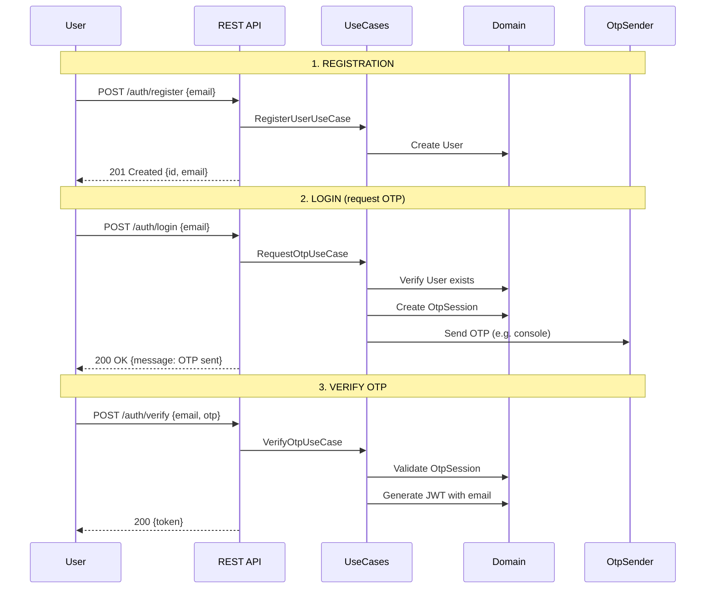
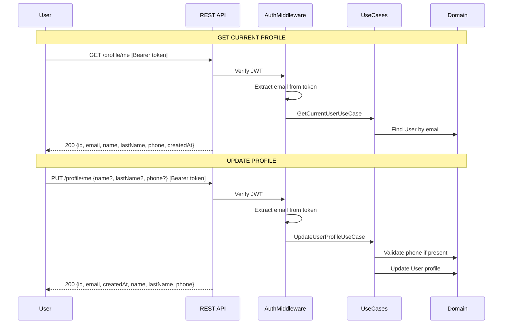

# Authentication Flow

## Registration and OTP-based Login



## Protected Endpoints (Current User)



## Endpoints

Rutas de autenticación y perfil (ver `src/shared/infrastructure/server.ts`).

| Method | Endpoint | Auth | Description |
|--------|----------|------|-------------|
| POST | `/auth/register` | No | Alta de usuario con email |
| POST | `/auth/login` | No | Solicitud de OTP (envío según adaptador configurado) |
| POST | `/auth/verify` | No | Verificación de OTP y obtención del JWT |
| GET | `/profile/me` | JWT | Obtiene el perfil del usuario autenticado |
| PUT | `/profile/me` | JWT | Actualización parcial de perfil (mínimo un campo) |

## OTP Code

Reglas de negocio del código OTP (entidad `OtpSession`).

- 6-digit numeric code.
- Valid for 5 minutes after generation.
- Single use (session removed after successful verification).
- Up to 3 failed verification attempts; then the account is locked for 10 minutes (`Account locked` on verify, `Account is locked` when requesting a new OTP while locked).

## JWT Token

El token se firma con HS256; el middleware resuelve al usuario por el claim `email`.

- Payload includes `email` (not `userId`).
- Default expiration: 24 hours.
- Algorithm: HS256.

## Profile Fields

Validación en capa HTTP (`validateProfileUpdateBody`) y dominio (`Phone`).

| Field | Type | Validation |
|-------|------|------------|
| `name` | string | Optional in schema; body must include at least one of `name`, `lastName`, or `phone` |
| `lastName` | string | Same as above |
| `phone` | string | If present: 7–15 digits only (no `+` prefix in the API) |

Unexpected JSON keys are rejected (400).

## Request/Response Examples

### Register User

```http
POST /auth/register
Content-Type: application/json

{"email": "user@example.com"}
```

Response 201:

```json
{
  "id": "550e8400-e29b-41d4-a716-446655440000",
  "email": "user@example.com"
}
```

### Request OTP

```http
POST /auth/login
Content-Type: application/json

{"email": "user@example.com"}
```

Response 200:

```json
{"message": "OTP sent"}
```

### Verify OTP

```http
POST /auth/verify
Content-Type: application/json

{"email": "user@example.com", "otp": "123456"}
```

Response 200:

```json
{"token": "eyJhbGciOiJIUzI1NiIsInR5cCI6IkpXVCJ9..."}
```

### Get Current Profile

```http
GET /profile/me
Authorization: Bearer <token>
```

Response 200:

```json
{
  "id": "550e8400-e29b-41d4-a716-446655440000",
  "email": "user@example.com",
  "name": "Jane",
  "lastName": "Doe",
  "phone": "612345678",
  "createdAt": "2024-01-01T00:00:00.000Z"
}
```

### Update Profile

```http
PUT /profile/me
Authorization: Bearer <token>
Content-Type: application/json

{"name": "Jane", "lastName": "Doe", "phone": "612345678"}
```

Response 200:

```json
{
  "id": "550e8400-e29b-41d4-a716-446655440000",
  "email": "user@example.com",
  "createdAt": "2024-01-01T00:00:00.000Z",
  "name": "Jane",
  "lastName": "Doe",
  "phone": "612345678"
}
```

## Error Responses

La API devuelve `{ "error": "message" }` para errores de dominio y validación. Algunos mensajes representativos:

| Status | Cuándo | Ejemplo de mensaje |
|--------|--------|---------------------|
| 400 | Validación / cuerpo inválido | `Invalid email format`, `No OTP session found`, `Invalid OTP`, `OTP must be 6 numeric digits`, `Unexpected fields: foo`, `At least one of name, lastName, or phone is required`, `Invalid phone format`, `Invalid request body`, `Invalid value for name` (y análogos para otros campos) |
| 401 | Perfil sin token o token inválido | `Authorization token required`, `Invalid or expired token` |
| 404 | Recurso no encontrado (auth) | `User not found` |
| 409 | Email duplicado | `Email already registered` |
| 429 | Bloqueo por OTP | `Account is locked`, `Account locked` |
| 500 | Error técnico | `Internal server error` |

## OpenAPI Specification

Con el servidor en marcha, la UI interactiva (**Swagger UI**) está en **`/api-docs/`** (barra final recomendada; sin barra el servidor puede responder **301**). La misma spec se sirve en **`GET /openapi.yaml`** (coincide con el archivo en repo [`openapi.yaml`](./openapi.yaml)).

También puedes importar [`openapi.yaml`](./openapi.yaml) en Postman, Insomnia o Swagger Editor si prefieres herramientas externas.

## Base URL and Port

La especificación OpenAPI usa `http://localhost:8080`. El valor por defecto del proyecto en código y `.env.example` es `PORT=3000`. Para coincidir con la spec, arranca con `PORT=8080` (o ajusta el `servers.url` en el YAML si usas otro puerto).

## Viewing Mermaid Diagrams

Los diagramas Mermaid se renderizan en GitHub/GitLab al ver este archivo.

### In Cursor/VS Code

1. Install the extension **Markdown Preview Mermaid Support** (`bierner.markdown-mermaid`).
2. Open this `.md` file.
3. Press `Cmd + Shift + V` (Mac) or `Ctrl + Shift + V` (Windows/Linux) for preview, or `Cmd + K V` for side preview.
